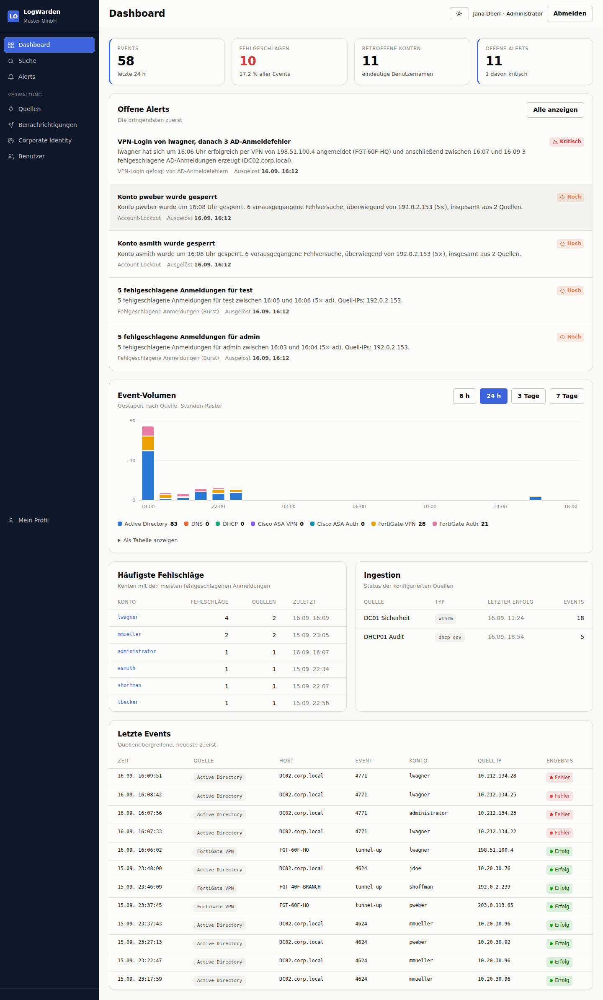
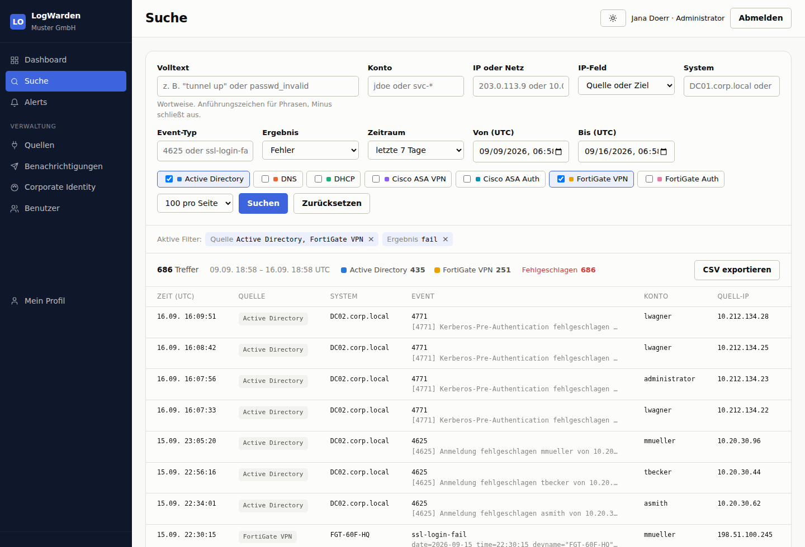
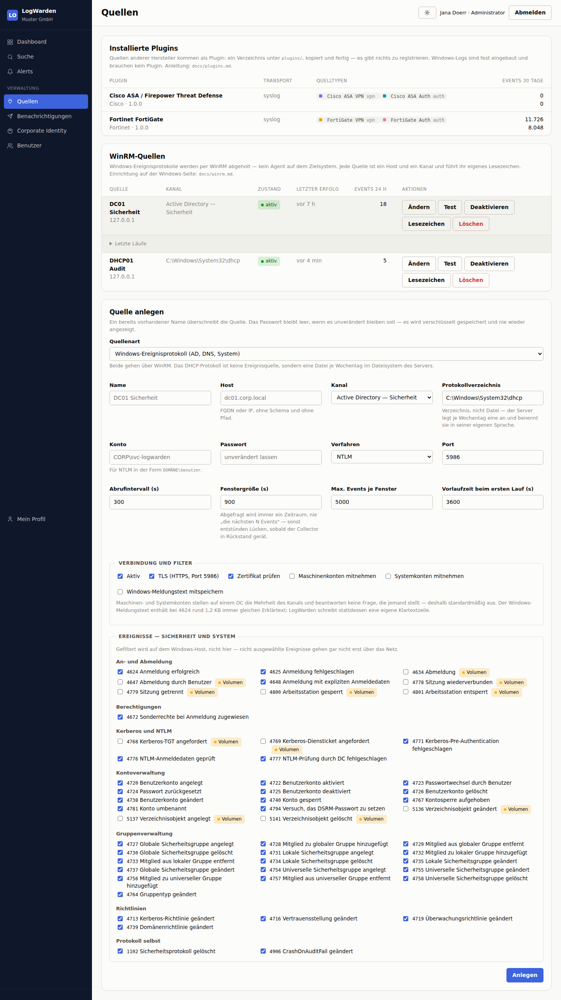

# LogWarden

Selbstgehostetes, SIEM-ähnliches Werkzeug zur Sammlung, Normalisierung, Suche
und Alarmierung von Security-Logs aus einer gemischten Windows-/Fortinet-
Infrastruktur. Kein Agent auf den Zielsystemen.

**Stand:** Fundament, FortiGate-Syslog-Ingestion, der WinRM-Collector für
Windows-Logs, Suche, Rule-Engine, Teams-Benachrichtigung und die Anmeldung
sind fertig und getestet. Siehe [Roadmap](#roadmap).

---

## Oberfläche



Offene Alerts zuerst, darunter Volumen nach Quelle, die Konten mit den meisten
Fehlschlägen und der Zustand der Collector.



Jeder Filter steht im Query-String — eine Suche ist ein Link, den man in ein
Ticket einfügen kann. Geblättert wird per Keyset, Seite 144 ist so schnell wie
Seite 1.



Weitere Ansichten in [docs/screenshots/](docs/screenshots/): Alert-Detail,
Benutzerverwaltung, Corporate Identity, Anmeldung — jeweils hell und dunkel.

---

## Architekturentscheidungen

### PostgreSQL 16+ als einziger Datenspeicher

| Anforderung | Umsetzung |
|---|---|
| Hohes Event-Volumen | Tages-Partitionen auf `events.ts`; Retention = `DROP TABLE` statt Delete-Storm |
| Zeitraum-Suche | Partition-Pruning; Queries fassen nur die betroffenen Tage an |
| Volltext | Natives `tsvector`/GIN — der Index existiert nur auf den letzten N Tagen |
| Feld-Suche | `inet`-Typ für echte Subnetz-Queries, `jsonb` + GIN für quellenspezifische Felder |
| Quellenübergreifende Korrelation | Joins und Window-Functions: „VPN-Login, dann AD-Fehlschlag" ist *eine* Query |
| Konfiguration und Alerts | Transaktional, im selben System |

OpenSearch wurde verworfen, weil es keine Joins kennt (Korrelationsregeln würden
zu Applikationslogik) und weil Konfiguration plus Alert-Status ohnehin eine
zweite, relationale Datenbank erfordert hätten.

### Frontend ohne Build-Step

Server-gerenderte PHP-Templates, ein Stylesheet mit CSS-Custom-Properties und
eine Datei progressiv verbesserndes JavaScript. Kein npm, kein Bundler, keine
Web-Fonts von fremden Servern. Diagramme sind handgeschriebenes Inline-SVG und
funktionieren auch mit deaktiviertem JavaScript.

### Rule-Engine

Regeln sind Plugins: eine Datei in `src/Rules/Builtin/`, eine Zeile in `rules`.
Die Datenbank speichert einen Schlüssel, keinen Klassennamen — ein
`new $row['rule_class']` würde aus Schreibzugriff auf eine Konfigurationstabelle
beliebige Objekterzeugung machen.

Ein offener Alert ist pro Entität eindeutig. Eine anhaltende Lage lässt den
bestehenden Alert wachsen, statt die Liste mit fast identischen Kopien zu
füllen; `cooldown_s` steuert nur die Wiederbenachrichtigung. Geschlossen wird
nie automatisch. Details in [docs/rules.md](docs/rules.md).

### Suche

Jede Abfrage ist zeitlich begrenzt, damit PostgreSQL Partitionen ausschließen
kann, und geblättert wird per Keyset statt per OFFSET: Seite 144 ist so schnell
wie Seite 1. Trefferzahl und Verteilung sind gedeckelt, weil ein exaktes
Aggregat über alle Treffer linear im Volumen wächst.

Alle Filter stehen im Query-String — eine Suche ist ein Link, den man in ein
Ticket einfügen kann. Details in [docs/search.md](docs/search.md).

### Benachrichtigung

Microsoft Teams über Incoming Webhooks, als Adaptive Card. Ein Alert erreicht
einen Kanal nur, wenn die Regel zugeordnet ist **und** der Schweregrad den
Mindestwert des Kanals erreicht.

Die Webhook-URL ist das Zugangsgeheimnis: verschlüsselt gespeichert, nie
protokolliert, in der Oberfläche nie wieder angezeigt. URLs, die auf interne
Adressen auflösen, werden abgelehnt — sonst wäre LogWarden ein Anfrage-Proxy
ins eigene Netz. Details in [docs/notifications.md](docs/notifications.md).

### Corporate Identity

Unter *Verwaltung → Corporate Identity* lassen sich Produktname, Logos,
Primär-/Navigations-/Akzentfarbe, Schriftfamilie, Eckenform, Dichte und
Standard-Modus einstellen. Daraus wird `/theme.css` generiert, das die
Brand-Tokens des Design-Systems überschreibt.

Zwei Dinge sind bewusst **nicht** anpassbar:

* **Schweregrad-Farben von Alerts** — sie kodieren Bedeutung.
* **Farbskala der Diagramme** — als Satz auf Farbfehlsichtigkeit geprüft.

Die Lesbarkeit wird nicht dem Zufall überlassen: Aus der gewählten Markenfarbe
berechnet LogWarden nach WCAG die Schriftfarbe für Buttons und dunkelt die Farbe
für Fließtext ab, bis sie 4,5:1 erreicht. Die Einstellungsseite zeigt die
Kontrastwerte an.

### Quellen als Plugins, Windows fest eingebaut

Windows-Logs gehören zum Kern: AD, DNS und DHCP teilen sich den
WinRM-Collector, sie sind der Grund, warum das Werkzeug in einer
Windows-Umgebung existiert, und eine Plugin-Grenze zwischen ihnen wäre eine
Grenze, die nie jemand überquert.

Alles andere ist ein Plugin — ein Verzeichnis unter `plugins/`, kopiert und
fertig. FortiGate und Cisco ASA liegen bei; weitere Hersteller kommen dazu,
ohne den Kern anzufassen.

Der Punkt daran ist nicht die Ordnerstruktur, sondern die **Rolle**: Jeder
Quelltyp sagt, *was* er ist (`vpn`, `auth`, `directory`, …), nicht nur von
wem er stammt. Die Korrelationsregel fragt deshalb nach „einem VPN-Login,
gefolgt von Anmeldefehlern im Verzeichnis" statt nach `fortigate_vpn`. Wer das
Cisco-Plugin installiert, ist sofort in jeder bestehenden Regel dabei.

Ein Plugin öffnet keine Sockets, stellt keine Abfragen und sieht die
Konfiguration nicht — es bekommt eine Rohzeile und sagt, was sie bedeutet.
Details in [docs/plugins.md](docs/plugins.md).

### Windows-Logs per WinRM

Kein Agent auf den Domain Controllern: LogWarden holt die Ereignisprotokolle
über WinRM ab und filtert dabei schon auf dem Windows-Host, sodass nicht
ausgewählte Ereignisse gar nicht erst über das Netz gehen.

Abgefragt wird immer ein **Zeitraum**, nie „die nächsten N Events". Der
naheliegende Weg ist auf Windows unauffällig falsch: `Get-WinEvent` liefert die
neuesten zuerst, `-MaxEvents` wählt also die neuesten N Treffer. Ein Collector
mit Rückstand bekäme die neuesten und übersprünge die dazwischen — dauerhaft
und ohne Fehlermeldung. Über ein Zeitfenster ist Vollständigkeit dagegen
prüfbar: entweder der Zeitraum kam unter der Obergrenze zurück, oder das
Fenster wird halbiert und erneut versucht.

Welche Ereignisse mitgenommen werden, ist eine Volumen- und keine
Übersetzungsfrage: 4769 allein kann 80 % des Kanals eines DCs ausmachen und
beantwortet keine Frage, während 4740 und 4728 ein paar Mal pro Woche
vorkommen und jedes Mal zählen. Details in [docs/winrm.md](docs/winrm.md).

### Anmeldung und Rollen

Zwei Wege hinein: **LDAP/AD-Bind** gegen einen Domain Controller und, davon
unabhängig, **lokale Konten** in der Datenbank (Argon2id). Die lokalen Konten
sind der Rückweg, wenn das Verzeichnis nicht erreichbar ist — LogWarden
unterscheidet eine falsche Anmeldung von einer Verzeichnisstörung und zählt
letztere nicht auf die Kontosperre.

Berechtigungen kommen nie aus dem Verzeichnis, sondern aus einer Zuordnung in
*Verwaltung → Benutzer*: eine AD-Gruppe **oder** ein einzelnes Konto wird einer
der drei internen Stufen zugewiesen (Administrator, Analyst, Nur lesend). Ohne
Zuordnung kommt niemand hinein — `web.default_role` ist ab Werk leer.

Gebunden wird als der anmeldende Benutzer, nie mit einem Dienstkonto, und
niemals mit leerem Passwort: ein Bind mit DN und leerem Passwort ist laut
RFC 4513 §5.1.2 ein *unauthenticated bind*, den manche Verzeichnisse als Erfolg
quittieren. Details in [docs/auth.md](docs/auth.md).

---

## Installation

```bash
# 1. Abhängigkeiten (Debian/Ubuntu)
apt install php8.4-cli php8.4-fpm php8.4-pgsql php8.4-curl php8.4-mbstring \
            php8.4-xml php8.4-ldap postgresql-16 nginx
# php8.4-curl wird auch für den WinRM-Collector gebraucht (NTLM/Kerberos)
# php8.4-ldap wird für die AD-Anmeldung gebraucht; ohne die Erweiterung
# funktionieren nur lokale Konten.

# 2. Datenbank
sudo -u postgres createuser --pwprompt logwarden
sudo -u postgres createdb --owner=logwarden logwarden

# 3. Konfiguration
cp config/config.php.dist config/config.php
$EDITOR config/config.php

# 4. Schlüssel für verschlüsselte Credentials
bin/logwarden-keygen          # legt config/secret.key mit Modus 0600 an

# 5. Schema und Partitionen
bin/logwarden-migrate
bin/logwarden-plugins --sync   # Quelltypen der installierten Plugins eintragen
bin/logwarden-maintenance

# 6. Erstes Administratorkonto (fragt das Passwort ohne Echo ab)
bin/logwarden-user --create=admin --role=admin

# 6b. Optional: einen Monat Demo-Daten, um die Oberfläche anzusehen,
#     bevor die erste echte Quelle hängt
bin/logwarden-seed-demo --yes
bin/logwarden-rules                    # erzeugt die zugehörigen Alerts
bin/logwarden-seed-demo --purge --yes  # rückstandsfrei wieder weg

# 7. Dienste
cp deploy/systemd/* /etc/systemd/system/
systemctl enable --now logwarden-syslogd logwarden-rules.timer \
                       logwarden-notify.timer logwarden-maintenance.timer \
                       logwarden-spool-replay.timer logwarden-winrm.timer
```

`composer install` ist optional — ohne Composer greift ein eingebauter
PSR-4-Autoloader, sodass ein einfaches Kopieren des Verzeichnisses genügt.

### Weboberfläche lokal ansehen

```bash
bin/logwarden-serve 8080      # bindet ausschließlich an 127.0.0.1
```

Jede Seite außer `/login` verlangt eine Anmeldung; es gibt keinen
unauthentifizierten Modus. Für den ersten Zugang dient das in Schritt 6
angelegte lokale Konto — die AD-Anbindung lässt sich danach in Ruhe unter
*Verwaltung → Benutzer* einrichten.

---

## Weitere Quellen anbinden

Quellen anderer Hersteller kommen als Plugin — ein Verzeichnis unter
`plugins/`, das man hineinkopiert. Mitgeliefert sind FortiGate und Cisco ASA.

```bash
bin/logwarden-plugins --list            # installierte Plugins und Quelltypen
bin/logwarden-plugins --test=cisco-asa  # Fixtures durch die Normalizer schicken
bin/logwarden-plugins --sync            # Quelltypen in die Datenbank schreiben
systemctl restart logwarden-syslogd
```

Wie man ein eigenes schreibt, steht in [docs/plugins.md](docs/plugins.md).

## FortiGate anbinden

Auf der FortiGate:

```
config log syslogd setting
    set status enable
    set server "10.0.0.50"
    set port 514
    set mode udp          # oder: reliable (TCP) bzw. udp mit enc-algorithm für TLS
    set format default    # 'cef' wird ebenfalls unterstützt
end
```

In `config/config.php` unbedingt `syslog.allow_from` auf die FortiGate-Adressen
setzen. UDP-Syslog ist nicht authentifiziert und die Absenderadresse trivial
fälschbar; wer mehr braucht, nutzt TCP/TLS mit Client-Zertifikaten
(`syslog.tls.ca_file`).

### Ohne FortiGate testen

```bash
# Ein einzelnes Event per UDP
logger -n 127.0.0.1 -P 5514 -d \
  'date=2026-09-15 time=10:01:15 devname="FGT-60F-HQ" logid="0101039426" type="event" subtype="vpn" action="ssl-login-fail" remip=198.51.100.44 user="CORP\asmith"'

# Die mitgelieferten Fixtures per netcat
grep -v '^#' plugins/fortigate/fixtures/fortigate-native.log | nc -q1 127.0.0.1 5514
```

Welche Events erkannt und welche verworfen werden, steht in
`plugins/fortigate/`: gespeichert werden VPN (`logid 0101…`) und
Authentifizierung (`logid 0102…`), Traffic- und UTM-Logs werden verworfen.

---

## Struktur

```
bin/          CLI-Entrypoints (Daemons und Jobs)
config/       Konfiguration und Master-Key (gitignored)
db/           Migrationen und Seed-Daten
src/
  Core/       Config, Db, Logger
  Security/   Anmeldung, Rollen, Sessions, SecretBox (libsodium)
  Event/      Event-DTO, Batch-Writer, Normalizer-Contract, Quelltypen
  Plugin/     Plugin-Vertrag, Registry, Quelltyp-Abgleich
  Ingest/     Syslog/, Winrm/, Windows/, Dhcp/
  Rules/      Regel-Interface, Registry, Engine und eingebaute Regeln
  Alerting/   Alert-Persistenz und Abfragen
  Notify/     Teams-Webhook
  Search/     Query-Bau und Dashboard-Aggregate
  Web/        Router, Controller, Branding, Farbmathematik, Charts
plugins/      Quellen fremder Hersteller (fortigate/, cisco-asa/)
public/       Einziger DocumentRoot
templates/    PHP-Templates
deploy/       systemd-Units, nginx-Beispiel, windows/ (JEA-Konfiguration)
tests/        Unit-Tests und FortiGate-Fixtures
```

## Benachrichtigung einrichten

```bash
echo 'https://prod-01.westeurope.logic.azure.com/workflows/…' \
  | bin/logwarden-notify --set-webhook='SOC-Teams'

bin/logwarden-notify --test=1          # Testkarte senden
bin/logwarden-notify --list-channels   # Status aller Kanäle
bin/logwarden-notify --dry-run
```

## Windows-Quellen anbinden

Auf dem Domain Controller einen HTTPS-Listener und ein nur lesendes
Sammelkonto einrichten — die vollständige Anleitung samt Kanalrechten und
Überwachungsrichtlinien steht in [docs/winrm.md](docs/winrm.md):

```powershell
winrm enumerate winrm/config/listener                       # was ist da?
Add-LocalGroupMember -Group 'Remote Management Users' -Member 'CORP\svc-logwarden'
Add-LocalGroupMember -Group 'Event Log Readers'      -Member 'CORP\svc-logwarden'
```

Danach unter *Verwaltung → Quellen* anlegen und **Test** drücken. Der Test
prüft Erreichbarkeit, Anmeldedaten und Kanalzugriff getrennt, weil dahinter
drei verschiedene Ursachen mit drei verschiedenen Lösungen stecken.

```bash
bin/logwarden-winrm --list                    # Zustand aller Quellen
bin/logwarden-winrm --test='DC01 Sicherheit'
bin/logwarden-winrm --dry-run                 # abrufen, nichts schreiben
```

## Benutzer und Zuordnungen

```bash
bin/logwarden-user --create=admin --role=admin   # lokales Konto anlegen
bin/logwarden-user --list                        # Konten mit Rolle und Status
bin/logwarden-user --passwd --user=admin         # Passwort setzen
bin/logwarden-user --unlock --user=admin         # Kontosperre aufheben
bin/logwarden-user --map-group='SOC-Analysten' --role=analyst
bin/logwarden-user --map-user='pweber' --role=readonly
```

## Regeln prüfen

```bash
bin/logwarden-rules --list       # was auf der Platte gefunden wurde
bin/logwarden-rules --dry-run    # auswerten, ohne zu schreiben
bin/logwarden-rules --rule=failed_login_burst
```

## Tests

```bash
php tests/run.php

# Datenbanktests (Reconnect, Suche, Anmeldung) gegen eine Wegwerf-Datenbank
LW_TEST_DSN='host=/var/run/postgresql;dbname=logwarden_test;user=logwarden;password=…' \
  php tests/run.php

# Zusätzlich gegen ein echtes Verzeichnis (sonst werden die LDAP-Tests
# übersprungen; erwartet wird die Testdomäne aus tests/Unit/AuthTest.php)
LW_TEST_LDAP='ldap://127.0.0.1:389' php tests/run.php

# WinRM-Protokolltests gegen den mitgelieferten Mock-Endpunkt
php tests/support/winrm-mock.php --listen=127.0.0.1:5985 --ntlm &
LW_TEST_WINRM='127.0.0.1:5985' php tests/run.php
```

Der Mock spricht die MS-WSMV-Shell-Konversation wirklich — inklusive
NTLM-Handshake, Verbindungswiederverwendung und mehrteiliger Base64-Ströme.
Er ersetzt keinen Domain Controller; was damit **nicht** geprüft ist, steht
am Ende von [docs/winrm.md](docs/winrm.md).

## Roadmap

| Schritt | Status |
|---|---|
| Fundament, Schema, Partitionierung | fertig |
| Syslog-Ingestion (UDP/TCP/TLS, CEF + key=value) | fertig |
| Design-System und Corporate Identity | fertig |
| Dashboard | fertig |
| Rule-Engine und die drei Startregeln | fertig |
| Alert-Übersicht und Detailansicht | fertig |
| Such- und Filteransicht, Event-Detailansicht ([Doku](docs/search.md)) | fertig |
| Teams-Benachrichtigung ([Doku](docs/notifications.md)) | fertig |
| Anmeldung, Rollen und Benutzerverwaltung ([Doku](docs/auth.md)) | fertig |
| WinRM-Collector für AD-Sicherheitsereignisse ([Doku](docs/winrm.md)) | fertig |
| Quellen als Plugins, FortiGate und Cisco ASA ([Doku](docs/plugins.md)) | fertig |
| DNS: Audit- und Server-Kanal mit eigenem Normalizer ([Strategie](docs/dns.md)) | fertig |
| DHCP-Audit-Log über WinRM ([Doku](docs/dhcp.md)) | fertig |
| CI-Pipeline: Lint und Tests bei jedem Push | offen |
| Verifikation des WinRM-Pfads gegen einen echten Domain Controller | offen |
| JEA-Endpunkt ansteuern (`deploy/windows/` liegt bereit) | offen |
| Gespeicherte Suchen — Tabelle existiert, Oberfläche fehlt | offen |
| DNS: optionale Analytic-Verdichtung ([Strategie](docs/dns.md)) | offen |

### Was als Nächstes sinnvoll ist

Die ursprüngliche Quellenliste ist damit vollständig: AD, DNS, DHCP und
FortiGate liefern.

**Ein Testlauf gegen echte Windows-Server** gehört vor die Inbetriebnahme,
nicht danach — hier gab es kein Windows-System. Besonders die DHCP-Strecke
hängt an drei lokalisierten Details (Dateinamen, Datumsformat, ANSI-Codepage),
die auf einer deutschen Installation anders aussehen als in der Dokumentation.
Siehe das Ende von [docs/winrm.md](docs/winrm.md) und
[docs/dhcp.md](docs/dhcp.md).

### Zwei bekannte Fallstricke

**DNS** zerfällt in zwei sehr unterschiedliche Dinge. Der Audit-Kanal
(Zonen- und Record-Änderungen) ist standardmäßig aktiv, winzig und im Alltag
direkt nützlich — er ist angebunden und schreibt eine Änderungshistorie. Der
Analytic-Kanal schreibt eine Zeile pro Abfrage, auf einem produktiven DC
2.000–10.000 Events/s, und wird ausschließlich verdichtet auf dem DC selbst
erfasst, nicht roh. Die Begründung und die konkreten Filter stehen in
[docs/dns.md](docs/dns.md).

Die Event-IDs des Audit-Kanals sind aus Microsofts Dokumentation übernommen
und hier gegen keinen echten DNS-Server geprüft. Der Collector braucht sie
aber nicht: unbekannte IDs werden gesammelt und mit ihrer Nummer beschriftet,
und `bin/logwarden-winrm --discover=<Quelle>` fragt den Kanal selbst.

**WinRM in reinem PHP** ist WS-Management-SOAP über HTTPS mit `ext-curl` und
`CURLAUTH_NTLM`. Der Fallstrick dabei: NTLM authentifiziert die
*TCP-Verbindung*, nicht die Anfrage. Ein frisches curl-Handle je SOAP-Aufruf
würde den Dreiwegehandshake für jedes Receive wiederholen — und in genau dem
Protokoll, das gerade abgeholt wird, eine Spur aus 4624/4634-Paaren
hinterlassen. Das Handle lebt deshalb so lange wie die Shell.

Kerberos setzt ein curl mit GSSAPI-Support voraus; ob es vorhanden ist, zeigt
`php -r 'var_dump((bool)(curl_version()["features"] & CURL_VERSION_GSSAPI));'`.
